# Sigil — Architecture Blueprint

> *A mark of power and binding.* Agent OS for resilient, secure, and observable AI orchestration.

---

## 1. Vision & Core Evolution

Sigil is a **State-Synchronized Kernel** that manages, discovers, orchestrates, and observes remote domain-specific AI agents. It is **not** an agent framework — it sits above one (Microsoft Agent Framework) and provides the "operating system" services that individual agents need but shouldn't build themselves.

Agents are treated as **ephemeral workers**; the Kernel is the **sole source of truth**.

**Design pillars:**

| Concern | Approach |
|---------|----------|
| State | **Snapshot pushed, Delta returned** (zero callbacks) |
| Security | **Zero-Trust (mTLS + JWT + Sigil-Key)** |
| Resilience | **Pre-flight validation + Atomic state updates** |
| Concurrency | **Optimistic concurrency via ETags** |
| Audit | **Immutable audit trail on every state change** |
| Routing | **Weighted routing for canary/A-B testing** |
| Planning | **Pluggable planner — deterministic, LLM, or hybrid** |

**Core analogy:**

| Traditional OS | Sigil |
|----------------|----------|
| Processes | Domain Agents |
| Devices & Drivers | Tools / APIs / MCP Servers |
| Context Switch | **Context Snapshot** (state bundling) |
| System Calls | **Secure Gateway** (mTLS/JWT) |
| Virtual Memory | **Atomic Context Bus** (optimistic concurrency) |
| BIOS POST | **Pre-flight Validation** (`/sigil/validate`) |
| Process Scheduler | Orchestrator (routing & dispatch) |
| Service Registry | Agent Registry (discovery, versioning, weights) |
| Kernel Policies | Policy Engine (pre-flight, budgets, checkpoints, PII masking) |
| `top` / `htop` | Observability Dashboard (Angular UI) |

---

## 2. Architecture Overview

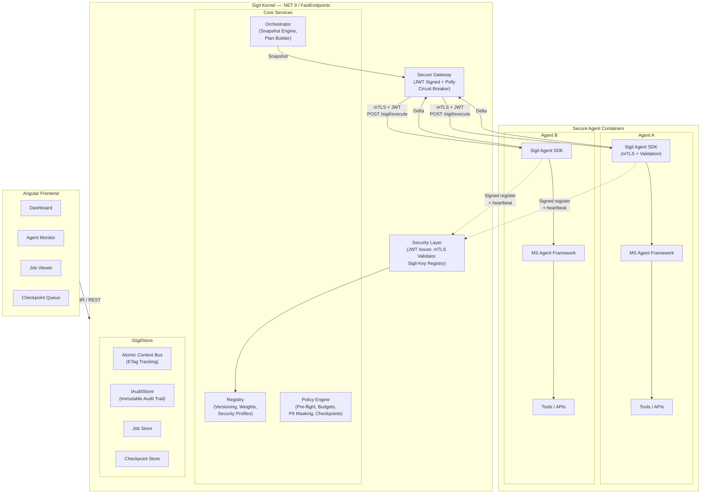

**Key principles:** Agents are **out-of-process**. Each runs as its own container, exposes the `/sigil/*` protocol, and self-registers via the SDK. The kernel never hosts agent logic — it only routes, observes, and enforces policy. All communication is signed and validated.

---

## 3. The Agent Protocol

### 3.1 Endpoint Map

Every remote agent exposes these HTTP endpoints (handled by the SDK):

| Endpoint | Method | Purpose |
|----------|--------|---------|
| `/sigil/validate` | POST | **Pre-flight check** — can the agent handle this task right now? (tokens, tools, resources) |
| `/sigil/execute` | POST | Receive **Task + Context Snapshot**, return **Delta** |
| `/sigil/health` | GET | Liveness + capability status |
| `/sigil/cancel/{taskId}` | POST | Cancel a running task |
| `/sigil/info` | GET | Agent metadata (id, domain, capabilities, version) |

### 3.2 Pre-flight Validation

Before dispatching a task, the Orchestrator calls `/sigil/validate`. This prevents **zombie tasks** — agents accepting work they can't finish.

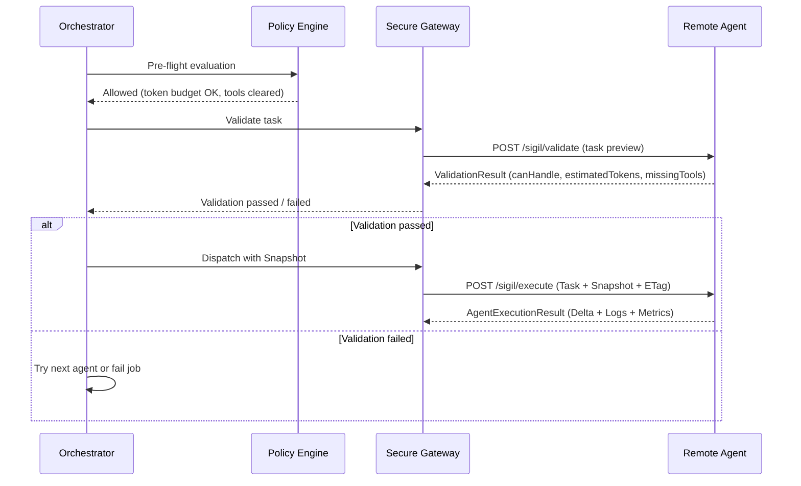

**Validation contract:**

```csharp
public record ValidationRequest
{
    public AgentTask Task { get; init; } = default!;
    public int AvailableTokenBudget { get; init; }
    public string[] AvailableTools { get; init; } = [];
}

public record ValidationResult
{
    public bool CanHandle { get; init; }
    public int EstimatedTokens { get; init; }
    public string[] MissingTools { get; init; } = [];
    public string? Reason { get; init; }
}
```

### 3.3 The Snapshot & Delta Pattern

Solves the **chatty context problem**. Instead of agents calling back to the kernel for shared state, the kernel bundles everything upfront.

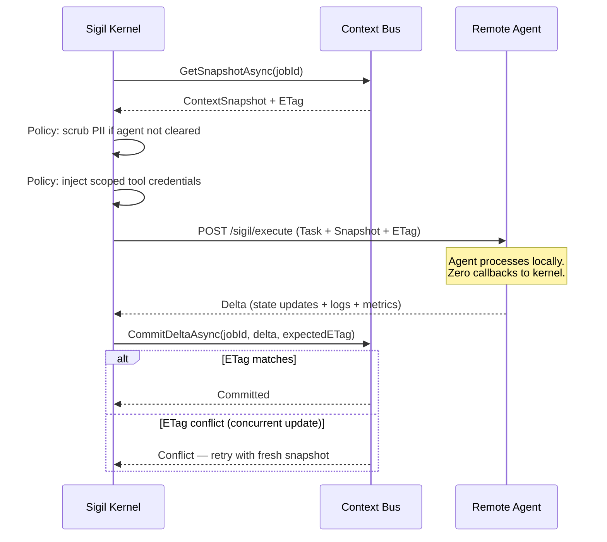

**Core types:**

```csharp
/// Sent TO the agent — everything it needs to do its job
public record AgentExecutionPackage
{
    public AgentTask Task { get; init; } = default!;
    public Dictionary<string, object> ContextSnapshot { get; init; } = new();
    public string ETag { get; init; } = default!;
    public Dictionary<string, string> ScopedCredentials { get; init; } = new();
}

/// Returned BY the agent — only what changed
public record AgentExecutionResult
{
    public string TaskId { get; init; } = default!;
    public bool Success { get; init; }
    public Dictionary<string, object> StateUpdates { get; init; } = new();
    public List<AgentLogEntry> Logs { get; init; } = [];
    public UsageMetrics Metrics { get; init; } = new();
    public string? Error { get; init; }
}

public record AgentLogEntry
{
    public DateTime Timestamp { get; init; } = DateTime.UtcNow;
    public string Level { get; init; } = "Info";
    public string Message { get; init; } = default!;
    public Dictionary<string, object>? Data { get; init; }
}

public record UsageMetrics
{
    public int InputTokens { get; init; }
    public int OutputTokens { get; init; }
    public int TotalTokens => InputTokens + OutputTokens;
    public TimeSpan Duration { get; init; }
    public Dictionary<string, double> Custom { get; init; } = new();
}
```

---

## 4. Core Subsystems

### 4.1 Secure Agent Registry

Agents must present a **Sigil-Key** or use **mTLS** to register. The registry supports **weighted routing** for canary deployments and A/B testing.

**Data model:**

```csharp
public record AgentRegistration
{
    public string AgentId { get; init; } = default!;
    public string Name { get; init; } = default!;
    public string Domain { get; init; } = default!;
    public List<Capability> Capabilities { get; init; } = [];
    public string SemanticVersion { get; init; } = "1.0.0";
    public string EndpointUrl { get; init; } = default!;
    public int RoutingWeight { get; init; } = 100;  // 0-100, for canary builds
    public AgentStatus Status { get; init; } = AgentStatus.Starting;
    public SecurityProfile Security { get; init; } = new();
    public DateTime RegisteredAt { get; init; } = DateTime.UtcNow;
    public DateTime LastHeartbeat { get; init; } = DateTime.UtcNow;
    public AgentMetadata Metadata { get; init; } = new();
}

public record Capability
{
    public string Name { get; init; } = default!;
    public string? Description { get; init; }
    public string[] RequiredTools { get; init; } = [];
    public int? EstimatedMaxTokens { get; init; }
}

public record SecurityProfile
{
    public string? CertificateThumbprint { get; init; }
    public string? SigilKey { get; init; }
    public bool IsPiiCleared { get; init; }
    public string[] AllowedTools { get; init; } = [];
}

public enum AgentStatus
{
    Starting,
    Healthy,
    Degraded,
    Offline,
    Draining
}

public record AgentMetadata
{
    public int? MaxTokenBudget { get; init; }
    public string? Model { get; init; }
    public Dictionary<string, string> Tags { get; init; } = new();
}
```

**Agent status lifecycle:**

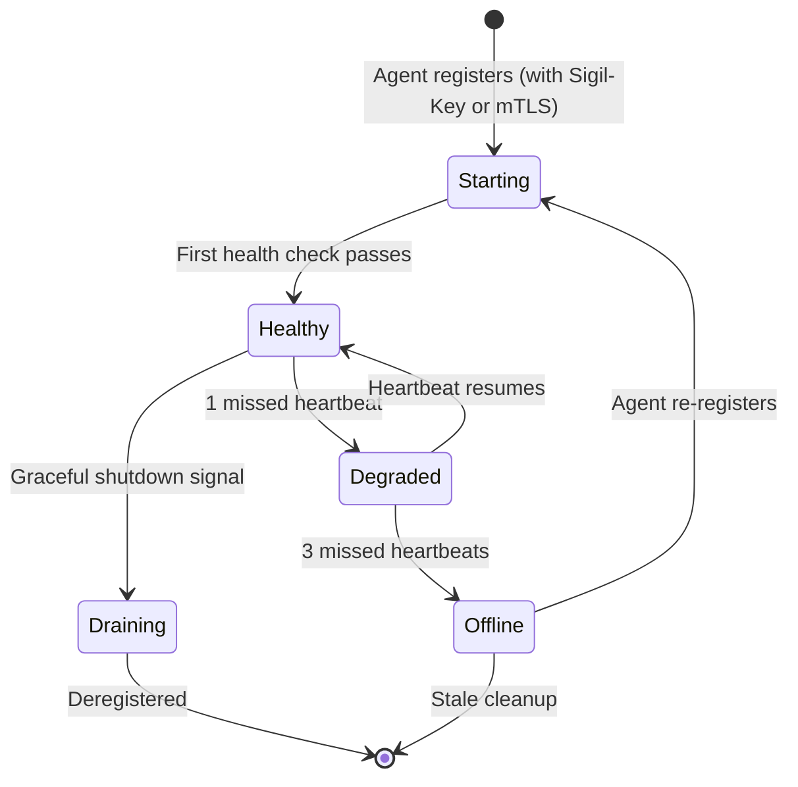

**Weighted routing:** When multiple agents match a capability, the orchestrator selects based on weight. A canary agent at weight 10 gets ~10% of traffic vs. a stable agent at weight 90.

**Key interface:**

```csharp
public interface IAgentRegistry
{
    Task<AgentRegistration> RegisterAsync(AgentRegistration registration);
    Task DeregisterAsync(string agentId);
    Task<AgentRegistration?> GetAsync(string agentId);
    Task<IReadOnlyList<AgentRegistration>> GetAllAsync();
    Task<IReadOnlyList<AgentRegistration>> FindByCapabilityAsync(string capabilityName);
    Task<IReadOnlyList<AgentRegistration>> FindByDomainAsync(string domain);
    Task<AgentRegistration?> SelectByWeightAsync(string capabilityName);
    Task UpdateHeartbeatAsync(string agentId);
    Task UpdateStatusAsync(string agentId, AgentStatus status);
}
```

---

### 4.2 Planner (Intent Decomposition)

The Planner sits between the intent and the execution plan. It decides **which agents** to involve and **in what order**. The `IPlanner` interface lives in `Sigil.Core` — the orchestrator delegates to it without knowing which strategy is active.

**Strategy pattern with hybrid escalation:**

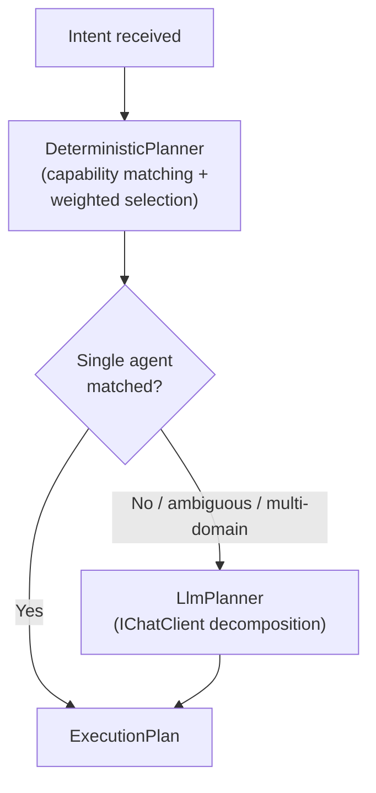

**Core interface (in `Sigil.Core`):**

```csharp
public interface IPlanner
{
    /// Build an execution plan for the given intent.
    /// Has access to the live registry to know what's available.
    Task<ExecutionPlan> PlanAsync(
        Intent intent,
        IReadOnlyList<AgentRegistration> availableAgents,
        CancellationToken ct = default);
}

public enum PlannerMode
{
    Deterministic,   // Capability match + weighted selection only
    LlmOnly,         // Always use LLM decomposition
    Hybrid           // Deterministic first, LLM fallback for complex intents
}
```

**DeterministicPlanner** — ships with Sigil Core. Zero LLM dependency:

```csharp
public class DeterministicPlanner : IPlanner
{
    public Task<ExecutionPlan> PlanAsync(
        Intent intent,
        IReadOnlyList<AgentRegistration> availableAgents,
        CancellationToken ct)
    {
        var steps = new List<ExecutionStep>();

        // Match by explicit capability or domain
        var candidates = availableAgents
            .Where(a => a.Status == AgentStatus.Healthy)
            .Where(a =>
                (intent.TargetCapability != null &&
                 a.Capabilities.Any(c => c.Name == intent.TargetCapability))
                ||
                (intent.TargetDomain != null &&
                 a.Domain == intent.TargetDomain))
            .ToList();

        // Weighted selection
        var selected = SelectByWeight(candidates);

        if (selected is not null)
        {
            steps.Add(new ExecutionStep
            {
                AgentId = selected.AgentId,
                Capability = intent.TargetCapability ?? selected.Capabilities[0].Name,
                Input = intent.Parameters
            });
        }

        return Task.FromResult(new ExecutionPlan
        {
            JobId = intent.JobId,
            Steps = steps
        });
    }
}
```

**LlmPlanner** — uses `IChatClient` (Microsoft.Extensions.AI) for provider-agnostic LLM calls:

```csharp
public class LlmPlanner : IPlanner
{
    private readonly IChatClient _chatClient;
    private readonly ILogger<LlmPlanner> _logger;

    public LlmPlanner(IChatClient chatClient, ILogger<LlmPlanner> logger)
    {
        _chatClient = chatClient;
        _logger = logger;
    }

    public async Task<ExecutionPlan> PlanAsync(
        Intent intent,
        IReadOnlyList<AgentRegistration> availableAgents,
        CancellationToken ct)
    {
        var systemPrompt = BuildSystemPrompt(availableAgents);
        var userPrompt = BuildUserPrompt(intent);

        var response = await _chatClient.GetResponseAsync(
            [
                new(ChatRole.System, systemPrompt),
                new(ChatRole.User, userPrompt)
            ],
            new ChatOptions
            {
                ResponseFormat = ChatResponseFormat.Json
            },
            ct);

        var plan = ParsePlan(intent.JobId, response.Text, availableAgents);

        _logger.LogInformation(
            "LLM planner decomposed intent into {StepCount} steps",
            plan.Steps.Count);

        return plan;
    }
}
```

**The system prompt** is built dynamically from the live registry. The LLM sees what's actually available right now:

```
You are the Sigil Planner — an execution plan builder for an Agent OS.

## Available Agents

{{#each agents}}
### {{Name}} ({{AgentId}})
- Domain: {{Domain}}
- Status: {{Status}}
- Capabilities:
{{#each Capabilities}}
  - {{Name}}: {{Description}} (max tokens: {{EstimatedMaxTokens}})
    Required tools: {{RequiredTools}}
{{/each}}
{{/each}}

## Your Task

Decompose the user's intent into a sequence of steps. Each step
assigns work to exactly one agent capability. Steps can declare
dependencies on prior steps.

Respond ONLY with JSON matching this schema:
{
  "steps": [
    {
      "agent_id": "string",
      "capability": "string",
      "description": "string",
      "input_keys": ["string"],      // context keys this step reads
      "output_keys": ["string"],     // context keys this step writes
      "depends_on": ["step_index"]   // indices of prior steps (0-based)
    }
  ]
}

Rules:
- Only use agents and capabilities from the list above.
- Only use agents with Status: Healthy.
- Minimize steps — don't decompose if one agent can handle it.
- Declare dependencies correctly so steps can run in parallel when possible.
- If no agents can handle the intent, return {"steps": []}.
```

**HybridPlanner** — the recommended default. Tries deterministic first, escalates to LLM when needed:

```csharp
public class HybridPlanner : IPlanner
{
    private readonly DeterministicPlanner _deterministic;
    private readonly LlmPlanner _llmPlanner;
    private readonly ILogger<HybridPlanner> _logger;

    public async Task<ExecutionPlan> PlanAsync(
        Intent intent,
        IReadOnlyList<AgentRegistration> availableAgents,
        CancellationToken ct)
    {
        // Try deterministic first
        var plan = await _deterministic.PlanAsync(intent, availableAgents, ct);

        if (plan.Steps.Count > 0)
        {
            _logger.LogDebug("Deterministic planner resolved intent");
            return plan;
        }

        // No clear match — escalate to LLM
        _logger.LogInformation(
            "Deterministic planner found no match, escalating to LLM");

        return await _llmPlanner.PlanAsync(intent, availableAgents, ct);
    }
}
```

**Consumer registration — pick your planner and LLM provider:**

```csharp
builder.AddSigil(sigil =>
{
    sigil.UseMongo(options => { /* ... */ });

    // Option A: Deterministic only (no LLM dependency)
    sigil.UsePlanner(PlannerMode.Deterministic);

    // Option B: Hybrid (deterministic + LLM fallback)
    sigil.UsePlanner(PlannerMode.Hybrid, planner =>
    {
        // Uses Microsoft.Extensions.AI — any IChatClient provider works
        planner.UseChatClient<AnthropicChatClient>();
        planner.MaxPlannerTokens = 2000;
        planner.Temperature = 0.0f;  // Deterministic output
    });

    // Option C: LLM always
    sigil.UsePlanner(PlannerMode.LlmOnly, planner =>
    {
        planner.UseChatClient<OllamaChatClient>();  // Local model
    });
});
```

**IChatClient providers (Microsoft.Extensions.AI ecosystem):**

| Provider | NuGet Package | Use Case |
|----------|---------------|----------|
| **Anthropic (Claude)** | `Microsoft.Extensions.AI.Anthropic` | Best reasoning, personal project default |
| **Azure OpenAI** | `Microsoft.Extensions.AI.AzureAIInference` | Enterprise / Azure environments |
| **OpenAI** | `Microsoft.Extensions.AI.OpenAI` | GPT models |
| **Ollama** | `Microsoft.Extensions.AI.Ollama` | Local models (Gemma, Llama, etc.) — air-gapped friendly |

The planner only needs a single `IChatClient` — swap providers by changing one line.

**Planner observability:**

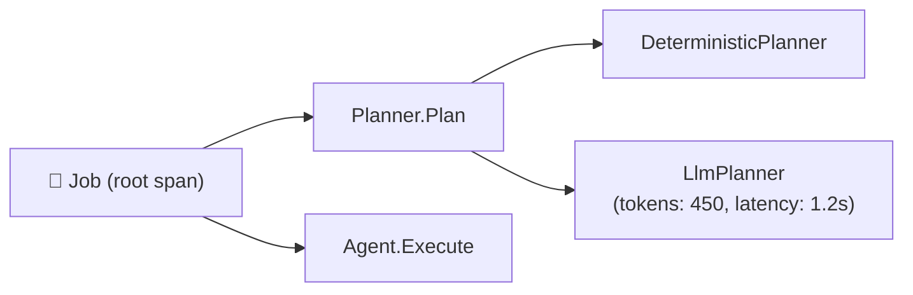

Every planner call is an OTel span. The LLM planner records token usage and latency, so you can track planning cost separately from execution cost.

---

### 4.3 Orchestrator (Snapshot Engine)

The orchestrator receives intents, delegates to the **Planner** for plan creation, bundles context snapshots, dispatches to agents, and commits deltas atomically.

**Execution flow:**

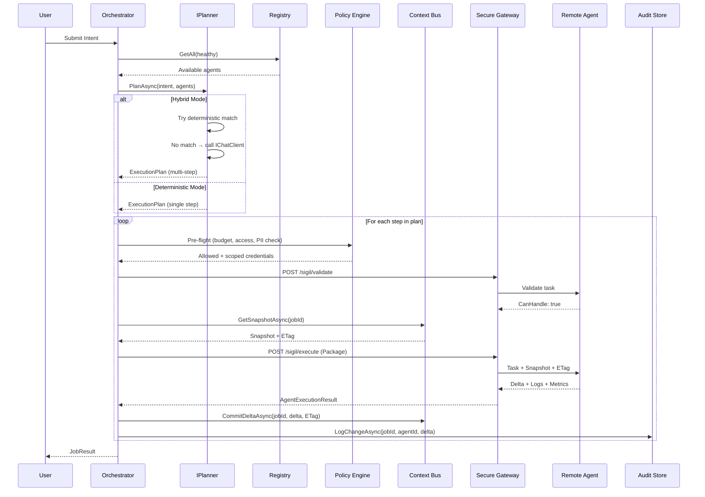

**Key interfaces:**

```csharp
public interface IOrchestrator
{
    Task<JobResult> ExecuteAsync(Intent intent, CancellationToken ct = default);
}

public record Intent
{
    public string JobId { get; init; } = Guid.NewGuid().ToString("N");
    public string Description { get; init; } = default!;
    public string? TargetDomain { get; init; }
    public string? TargetCapability { get; init; }
    public Dictionary<string, object> Parameters { get; init; } = new();
    public string RequestedBy { get; init; } = "system";
}

public record ExecutionPlan
{
    public string JobId { get; init; } = default!;
    public PlanSource Source { get; init; } = PlanSource.Deterministic;
    public UsageMetrics? PlannerMetrics { get; init; }  // LLM tokens used for planning
    public List<ExecutionStep> Steps { get; init; } = [];
}

public enum PlanSource
{
    Deterministic,
    Llm
}

public record ExecutionStep
{
    public string StepId { get; init; } = Guid.NewGuid().ToString("N");
    public string AgentId { get; init; } = default!;
    public string Capability { get; init; } = default!;
    public string? Description { get; init; }
    public Dictionary<string, object> Input { get; init; } = new();
    public string[] InputKeys { get; init; } = [];    // context keys this step reads
    public string[] OutputKeys { get; init; } = [];   // context keys this step writes
    public string[] DependsOn { get; init; } = [];    // step IDs this waits for
}
```

---

### 4.3 Atomic Context Bus

The Context Bus uses **Optimistic Concurrency** to prevent race conditions when multiple agents finish concurrently.

```csharp
public interface IContextStore
{
    /// Returns the full snapshot + its current ETag
    Task<(ContextSnapshot Snapshot, string ETag)> GetSnapshotAsync(string jobId);

    /// Commits a delta atomically. Fails if ETag has changed since snapshot was taken.
    Task<bool> CommitDeltaAsync(string jobId, ContextDelta delta, string expectedETag);

    /// Append to the interaction log
    Task AppendLogAsync(string jobId, AgentLogEntry entry);

    /// Get full interaction history
    Task<IReadOnlyList<AgentLogEntry>> GetLogAsync(string jobId);
}

public record ContextSnapshot
{
    public string JobId { get; init; } = default!;
    public Dictionary<string, object> State { get; init; } = new();

    public T? Get<T>(string key) =>
        State.TryGetValue(key, out var val) && val is T typed ? typed : default;
}

public record ContextDelta
{
    public Dictionary<string, object> Updates { get; init; } = new();
    public string[] Removals { get; init; } = [];
}
```

**Concurrency model:**

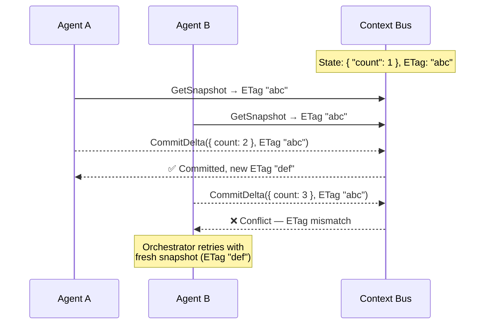

---

### 4.4 Zero-Trust Policy Engine

Policies are enforced at **pre-flight** — before the agent ever receives work. The engine also handles PII masking and scoped credential injection.

**Policy types:**

| Policy | Stage | Description |
|--------|-------|-------------|
| **Token Budget** | Pre-flight | Calculated before execution. Agent's estimated cost checked against remaining budget. |
| **Tool Access** | Pre-flight | Agent only receives credentials for tools required by the specific step. |
| **PII Masking** | Pre-flight | Snapshot scrubbed of sensitive data if agent is not `IsPiiCleared`. |
| **Checkpoint** | Pre-flight | Human approval required before write operations. Job pauses until resolved. |
| **Rate Limiting** | Pre-flight | Max concurrent jobs, requests per minute. |
| **Timeout** | Dispatch | Max execution time per step / per job (Polly). |
| **Retry** | Dispatch | Retry policy for transient failures (Polly circuit breaker). |

**Key interfaces:**

```csharp
public interface IPolicy
{
    string Name { get; }
    int Order { get; }
    PolicyStage Stage { get; }
    Task<PolicyResult> EvaluateAsync(PolicyContext context);
}

public enum PolicyStage
{
    PreFlight,   // Before validate/dispatch
    Dispatch,    // During dispatch (timeout, retry)
    PostExecution // After result received (audit, budget deduction)
}

public record PolicyContext
{
    public string JobId { get; init; } = default!;
    public string AgentId { get; init; } = default!;
    public string Capability { get; init; } = default!;
    public string Action { get; init; } = default!;
    public SecurityProfile AgentSecurity { get; init; } = new();
    public ContextSnapshot? Snapshot { get; init; }
    public Dictionary<string, object> Parameters { get; init; } = new();
}

public record PolicyResult
{
    public bool Allowed { get; init; }
    public string? Reason { get; init; }
    public string? PolicyName { get; init; }
    public bool RequiresCheckpoint { get; init; }
    public ContextSnapshot? ScrubbledSnapshot { get; init; } // PII-masked version
    public Dictionary<string, string> ScopedCredentials { get; init; } = new();

    public static PolicyResult Allow() => new() { Allowed = true };
    public static PolicyResult Deny(string policyName, string reason) =>
        new() { Allowed = false, PolicyName = policyName, Reason = reason };
    public static PolicyResult NeedCheckpoint(string policyName) =>
        new() { Allowed = false, PolicyName = policyName, RequiresCheckpoint = true };
}
```

**Checkpoint pattern (non-negotiable for writes):**

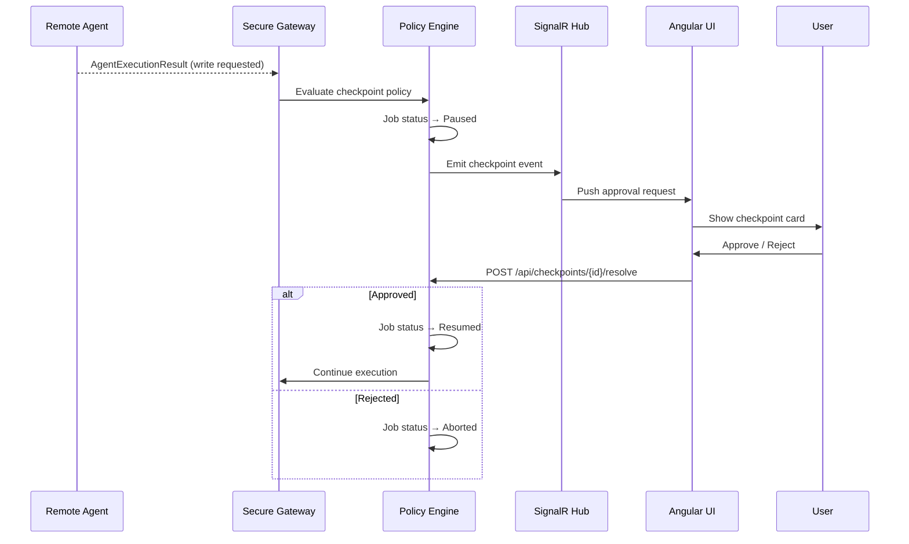

---

### 4.5 Security Model (Zero-Trust)

All agent ↔ kernel communication is authenticated and signed.

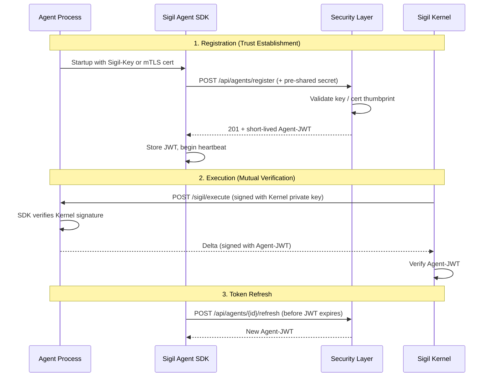

**Security tiers:**

| Tier | Auth Method | PII Access | Use Case |
|------|-------------|------------|----------|
| **Open** | Sigil-Key only | No | Dev/local agents |
| **Standard** | Sigil-Key + JWT | No | Production agents without sensitive data |
| **Trusted** | mTLS + JWT | Yes (PII-Cleared) | Agents handling personal data |

---

### 4.6 Storage Abstraction

The kernel depends on no specific database. All persistence flows through `ISigilStore` plus the new `IAuditStore`.

```csharp
public interface ISigilStore
{
    IAgentRegistrationStore Agents { get; }
    IJobStore Jobs { get; }
    IContextStore Contexts { get; }
    ICheckpointStore Checkpoints { get; }
    IAuditStore Audit { get; }
}
```

**Audit Store:**

Every context change is recorded immutably. This provides a complete history of who changed what and when.

```csharp
public interface IAuditStore
{
    Task LogChangeAsync(AuditEntry entry);
    Task<IReadOnlyList<AuditEntry>> GetHistoryAsync(string jobId);
    Task<IReadOnlyList<AuditEntry>> GetAgentHistoryAsync(string agentId);
}

public record AuditEntry
{
    public string AuditId { get; init; } = Guid.NewGuid().ToString("N");
    public string JobId { get; init; } = default!;
    public string AgentId { get; init; } = default!;
    public string StepId { get; init; } = default!;
    public ContextDelta Delta { get; init; } = default!;
    public UsageMetrics Metrics { get; init; } = new();
    public DateTime Timestamp { get; init; } = DateTime.UtcNow;
}
```

**Provider architecture:**

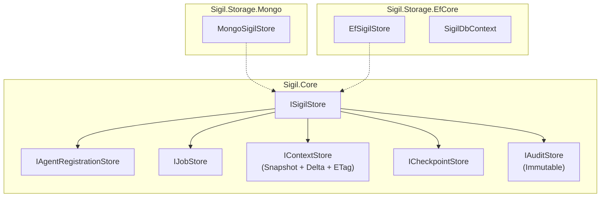

**Consumer registration:**

```csharp
// Option A: MongoDB
builder.AddSigil(sigil =>
{
    sigil.UseMongo(options =>
    {
        options.ConnectionString = "mongodb://localhost:27017";
        options.Database = "sigil";
    });
});

// Option B: EF Core
builder.AddSigil(sigil =>
{
    sigil.UseEfCore(options =>
    {
        options.UseNpgsql("Host=localhost;Database=sigil");
    });
});
```

---

### 4.7 Observability

Built on OpenTelemetry with structured logging and cost tracking.

**Trace hierarchy:**

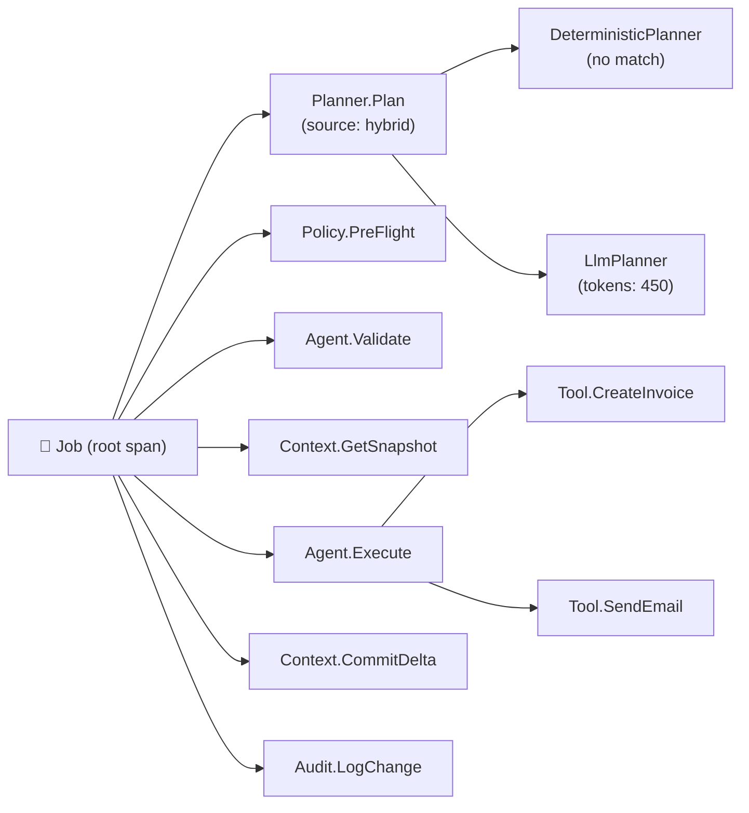

**Three pillars:**

| Pillar | Implementation |
|--------|-------------------|
| **Traces** | OpenTelemetry — `Job → Step → Tool` span hierarchy via `System.Diagnostics.Activity` |
| **Logs** | Structured JSON returned in the Delta package by each agent |
| **Metrics** | Cost-per-intent tracking ($/job), token usage, latency, success rates. Exportable to Prometheus/Grafana. |

---

### 4.8 Agent Health Monitor

A `BackgroundService` in the kernel that watches remote agents — it does **not** host them.

**Responsibilities:**
- Periodic health checks against registered agents' `/sigil/health` endpoints
- Status transitions: `Healthy → Degraded → Offline` based on missed heartbeats
- Stale registration cleanup (agents that never came back online)
- JWT expiry tracking — agents with expired tokens are marked `Degraded`
- Emit SignalR events on status transitions (real-time UI updates)

---

## 5. Agent SDK

The developer experience remains simple. The SDK handles Snapshot/Delta, mTLS, validation, and JWT refresh under the hood.

```csharp
// Agent's Program.cs
var builder = WebApplication.CreateBuilder(args);

builder.Services.AddSigilAgent(options =>
{
    options.AgentId = "research-agent";
    options.Name = "Research Agent";
    options.Domain = "research";
    options.Capabilities =
    [
        new Capability { Name = "deep-research", EstimatedMaxTokens = 5000 },
        new Capability { Name = "summarize", EstimatedMaxTokens = 1000 }
    ];
    options.Version = "2.0.0";
    options.SigilKernelUrl = "http://sigil-api:8080";
    options.RequireValidation = true;  // Enables /sigil/validate
    options.UseMTLS("certs/agent.pfx"); // Zero-Trust
});

builder.Services.AddScoped<ISigilAgentHandler, ResearchHandler>();

var app = builder.Build();
app.MapSigilAgent<ResearchHandler>();
app.Run();
```

**The handler now receives the Snapshot — zero callbacks needed:**

```csharp
public class ResearchHandler : ISigilAgentHandler
{
    public async Task<AgentExecutionResult> ExecuteAsync(
        AgentExecutionPackage package,
        CancellationToken ct)
    {
        // 1. Snapshot has all the data — no network calls to kernel
        var topic = package.ContextSnapshot.Get<string>("topic");
        var apiKey = package.ScopedCredentials["search-api-key"];

        // 2. Do domain work (using MS Agent Framework under the hood)
        var summary = await _researcher.ResearchAsync(topic, apiKey, ct);

        // 3. Return the Delta — only what changed
        return new AgentExecutionResult
        {
            TaskId = package.Task.TaskId,
            Success = true,
            StateUpdates = new()
            {
                ["research_summary"] = summary,
                ["research_completed_at"] = DateTime.UtcNow
            },
            Metrics = new UsageMetrics
            {
                InputTokens = 200,
                OutputTokens = 450,
                Duration = TimeSpan.FromSeconds(12)
            }
        };
    }

    // Optional: Pre-flight validation
    public Task<ValidationResult> ValidateAsync(ValidationRequest request)
    {
        return Task.FromResult(new ValidationResult
        {
            CanHandle = request.AvailableTokenBudget >= 1000,
            EstimatedTokens = 650,
            Reason = request.AvailableTokenBudget < 1000
                ? "Insufficient token budget" : null
        });
    }
}
```

**Self-registration flow (— with security handshake):**

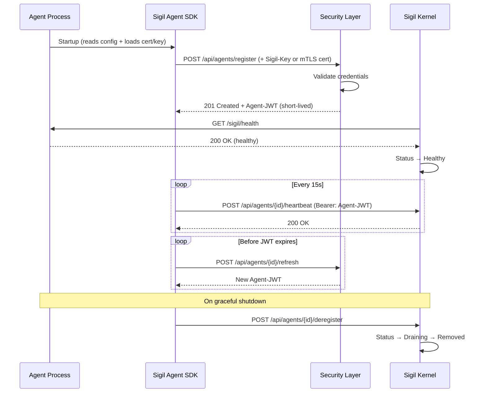

---

## 6. Angular Frontend

The UI serves as the operational dashboard — the "desktop environment" of the Agent OS.

### 6.1 Core Views

| View | Purpose |
|------|---------|
| **Dashboard** | Overview: active jobs, agent health grid, recent activity, cost tracking |
| **Agent Catalog** | Registered agents with capabilities, health, security tier, routing weight |
| **Job Monitor** | Live jobs — trace waterfall, step status, snapshot/delta inspector |
| **Job History** | Search and replay past jobs with full audit trail |
| **Checkpoint Queue** | Pending human approvals for write operations |
| **Intent Console** | Submit intents and watch execution in real-time |
| **Audit Explorer** | Browse the immutable audit log — who changed what and when |

### 6.2 Tech Stack

- Angular (standalone components, signals)
- SpartanNG / hlm component library
- Tailwind CSS
- Grid-based layouts
- SignalR for live updates (job status, agent health, checkpoints)

---

## 7. Infrastructure

### 7.1 Docker Compose (Local Dev)

```yaml
services:
  sigil-api:
    build:
      context: .
      dockerfile: src/Sigil.Api/Dockerfile
    ports:
      - "5100:8080"
    depends_on:
      - mongo
    environment:
      - ASPNETCORE_ENVIRONMENT=Development
      - MongoDB__ConnectionString=mongodb://mongo:27017
      - MongoDB__Database=sigil
      - Security__Mode=Open  # Open for local dev, Standard/Trusted for prod

  agent-echo:
    build:
      context: .
      dockerfile: src/agents/Sigil.Agent.Echo/Dockerfile
    environment:
      - ASPNETCORE_ENVIRONMENT=Development
      - Sigil__KernelUrl=http://sigil-api:8080
      - Sigil__AgentId=echo-agent
      - Sigil__SigilKey=dev-key-echo  # Open-tier auth for local dev
    depends_on:
      - sigil-api

  mongo:
    image: mongo:7
    ports:
      - "27017:27017"
    volumes:
      - sigil-data:/data/db

volumes:
  sigil-data:
```

### 7.2 Project Structure

```
sigil/
├── src/
│   ├── Sigil.Core/                    # Zero-dependency contracts
│   │   ├── Agents/
│   │   │   ├── AgentRegistration.cs
│   │   │   ├── Capability.cs
│   │   │   ├── SecurityProfile.cs
│   │   │   └── AgentHealthResponse.cs
│   │   ├── Protocol/
│   │   │   ├── AgentExecutionPackage.cs
│   │   │   ├── AgentExecutionResult.cs
│   │   │   ├── ValidationRequest.cs
│   │   │   ├── ValidationResult.cs
│   │   │   └── UsageMetrics.cs
│   │   ├── Context/
│   │   │   ├── ContextSnapshot.cs
│   │   │   └── ContextDelta.cs
│   │   ├── Orchestration/
│   │   │   ├── IOrchestrator.cs
│   │   │   ├── IPlanner.cs
│   │   │   ├── PlannerMode.cs
│   │   │   ├── Intent.cs
│   │   │   └── ExecutionPlan.cs
│   │   ├── Policy/
│   │   │   ├── IPolicy.cs
│   │   │   └── PolicyResult.cs
│   │   ├── Storage/
│   │   │   ├── ISigilStore.cs
│   │   │   ├── IAgentRegistrationStore.cs
│   │   │   ├── IJobStore.cs
│   │   │   ├── IContextStore.cs
│   │   │   ├── ICheckpointStore.cs
│   │   │   └── IAuditStore.cs
│   │   ├── Security/
│   │   │   ├── ISigilSecurity.cs
│   │   │   └── SecurityTier.cs
│   │   └── SigilBuilder.cs
│   │
│   ├── Sigil.Agent.SDK/               # NuGet package for agent developers
│   │   ├── ISigilAgentHandler.cs
│   │   ├── SigilAgentOptions.cs
│   │   ├── SigilAgentEndpoints.cs
│   │   ├── SelfRegistrationService.cs
│   │   ├── JwtRefreshService.cs
│   │   ├── ValidationEndpoint.cs
│   │   └── ServiceExtensions.cs
│   │
│   ├── Sigil.Storage.Mongo/
│   │   ├── MongoSigilStore.cs
│   │   ├── MongoAuditStore.cs
│   │   └── ServiceExtensions.cs
│   │
│   ├── Sigil.Storage.EfCore/
│   │   ├── SigilDbContext.cs
│   │   ├── EfSigilStore.cs
│   │   ├── EfAuditStore.cs
│   │   ├── Migrations/
│   │   └── ServiceExtensions.cs
│   │
│   ├── Sigil.Infrastructure/
│   │   ├── Gateway/
│   │   │   └── SecureAgentGateway.cs
│   │   ├── Security/
│   │   │   ├── JwtService.cs
│   │   │   ├── MTLSValidator.cs
│   │   │   └── SigilKeyValidator.cs
│   │   ├── Observability/
│   │   │   └── SigilActivitySource.cs
│   │   └── ServiceExtensions.cs
│   │
│   ├── Sigil.Runtime/
│   │   ├── AgentRegistry.cs
│   │   ├── AgentHealthMonitor.cs
│   │   ├── Orchestrator.cs
│   │   ├── SnapshotEngine.cs
│   │   ├── PolicyPipeline.cs
│   │   ├── Planners/
│   │   │   ├── DeterministicPlanner.cs
│   │   │   ├── LlmPlanner.cs
│   │   │   ├── HybridPlanner.cs
│   │   │   ├── PlannerPromptBuilder.cs
│   │   │   └── PlannerOptions.cs
│   │   ├── Policies/
│   │   │   ├── TokenBudgetPolicy.cs
│   │   │   ├── ToolAccessPolicy.cs
│   │   │   ├── PiiMaskingPolicy.cs
│   │   │   └── CheckpointPolicy.cs
│   │   └── ServiceExtensions.cs
│   │
│   ├── Sigil.Api/
│   │   ├── Endpoints/
│   │   │   ├── Agents/
│   │   │   ├── Jobs/
│   │   │   ├── Intents/
│   │   │   ├── Checkpoints/
│   │   │   └── Audit/
│   │   ├── Hubs/
│   │   │   └── SigilHub.cs
│   │   └── Program.cs
│   │
│   ├── agents/
│   │   ├── Sigil.Agent.Echo/
│   │   │   ├── EchoHandler.cs
│   │   │   ├── Program.cs
│   │   │   └── Dockerfile
│   │   └── Sigil.Agent.Weather/
│   │       ├── WeatherHandler.cs
│   │       ├── Program.cs
│   │       └── Dockerfile
│   │
│   └── sigil-ui/                      # Angular frontend
│       └── ...
│
├── docker-compose.yml
├── .forge/
├── .claude/
├── CLAUDE.md
└── README.md
```

---

## 8. Key Design Decisions

| Decision | Choice | Rationale |
|----------|--------|-----------|
| Agent hosting | Out-of-process (remote containers) | Isolation, fault tolerance — a bad agent can't crash the kernel |
| State model | **Snapshot & Delta** (push-execute-diff) | Eliminates chatty callbacks; agents work offline from kernel |
| Concurrency | **Optimistic (ETag)** | Prevents race conditions without distributed locks |
| Security | **Zero-Trust (mTLS + JWT + Sigil-Key)** | All communication authenticated; tiered access for PII |
| Pre-flight | **`/sigil/validate` before dispatch** | Prevents zombie tasks; token budget checked upfront |
| Routing | **Weighted selection** | Enables canary deployments and A/B testing |
| Audit | **Immutable `IAuditStore`** | Every state change recorded — who, what, when |
| Storage | Abstracted `ISigilStore` — Mongo + EF Core | Consumer chooses; kernel has zero storage dependencies |
| Agent SDK | `Sigil.Agent.SDK` NuGet | Handles registration, heartbeats, JWT refresh, validation, Snapshot/Delta — agent devs only write domain logic |
| Agent framework | MS Agent Framework (inside agents) | GA 1.0, .NET native, handles LLM plumbing |
| **Planner** | **`IPlanner` strategy (Deterministic / LLM / Hybrid)** in Core | Provider-agnostic; `IChatClient` for LLM; deterministic has zero LLM dependency |
| LLM abstraction | `IChatClient` (Microsoft.Extensions.AI) | Swap Claude, GPT, Ollama with one line; no Semantic Kernel bloat |
| Orchestration | Planner-driven — delegates plan creation to `IPlanner` | Orchestrator doesn't care how plans are built; planner is swappable |
| Observability | OTel + structured logs in Delta + cost metrics | Three-pillar observability with cost tracking |
| Policy | **Pre-flight pipeline** with PII masking | Policies enforced before agent ever receives work |
| Checkpoints | Non-negotiable for writes | Human-in-the-loop for all mutations |
| Frontend | SpartanNG + Tailwind | Consistent with personal project stack |

---

## 9. Phase Plan

### Phase 1 — Foundation + Security
- [ ] Solution scaffolding (Core, Storage.Mongo, Storage.EfCore, Infrastructure, Runtime, Api, Agent.SDK)
- [ ] `ISigilStore` + `IAuditStore` abstractions in Core
- [ ] Agent Protocol types (AgentExecutionPackage, AgentExecutionResult, ValidationRequest/Result)
- [ ] Security layer — Sigil-Key validation (Open tier for dev)
- [ ] MongoDB storage provider with ETag support
- [ ] EF Core storage provider with initial migration
- [ ] Secure Agent Registry (with routing weights)
- [ ] Agent Agent Protocol (`/sigil/validate`, `/sigil/execute` with Snapshot)
- [ ] `Sigil.Agent.SDK` — registration, heartbeat, validation endpoint, Snapshot/Delta handling
- [ ] Secure Gateway (JWT signed dispatch + Polly)
- [ ] Agent Health Monitor
- [ ] Echo Agent (using SDK)
- [ ] FastEndpoints (register, deregister, heartbeat, list, submit intent)
- [ ] Docker Compose (Kernel + Echo Agent + MongoDB)

### Phase 2 — Orchestration, Planner & Snapshot Engine
- [ ] `IPlanner` interface in Core
- [ ] `DeterministicPlanner` — capability match + weighted selection
- [ ] `LlmPlanner` — `IChatClient` integration, system prompt builder from live registry
- [ ] `HybridPlanner` — deterministic first, LLM fallback
- [ ] `PlannerOptions` + `UsePlanner()` on `SigilBuilder`
- [ ] Planner OTel spans (tokens used, latency, source: deterministic vs. LLM)
- [ ] Orchestrator refactored to delegate to `IPlanner`
- [ ] SnapshotEngine — build snapshot from context, scrub PII, inject credentials
- [ ] Pre-flight validation loop
- [ ] Atomic delta commit with ETag concurrency
- [ ] Immutable audit trail on every delta commit
- [ ] Job tracking with full step results + plan source
- [ ] Second sample agent (e.g., ResearchAgent)
- [ ] Multi-agent job execution with delta merging

### Phase 3 — Policy & Zero-Trust
- [ ] Pre-flight policy pipeline
- [ ] Token budget policy (estimated vs. actual)
- [ ] Tool access policy (scoped credential injection)
- [ ] PII masking policy
- [ ] Checkpoint policy (pause/resume jobs)
- [ ] JWT issuance + refresh for agents
- [ ] mTLS support (Trusted tier)
- [ ] Timeout and retry policies (Polly circuit breaker)

### Phase 4 — Observability
- [ ] OTel tracing (Activity + spans for validate/snapshot/execute/commit/audit)
- [ ] Structured log ingestion from Delta packages
- [ ] Cost-per-intent metrics ($/job)
- [ ] Token usage, latency, success rate dashboards
- [ ] Console exporter for local dev
- [ ] Job trace + audit storage

### Phase 5 — Angular Frontend
- [ ] Project scaffolding (standalone, SpartanNG, Tailwind)
- [ ] Dashboard (agent health grid, active jobs, cost overview)
- [ ] Agent Catalog (capabilities, security tier, routing weights)
- [ ] Job Monitor (trace waterfall, snapshot/delta inspector)
- [ ] Audit Explorer (immutable change history)
- [ ] Checkpoint Queue
- [ ] Intent Console
- [ ] SignalR integration for live updates

### Phase 6 — Polish & Extend
- [ ] Agent versioning and canary routing
- [ ] Multi-agent parallel execution with conflict resolution
- [ ] Job history search and replay with audit trail
- [ ] Agent-to-agent communication patterns
- [ ] MCP server integration as tool providers
- [ ] Prometheus/Grafana export for metrics

---

## 10. Open Questions

1. ~~**Agent hosting model**~~ — **RESOLVED: Out-of-process.** Agents are remote containers.
2. ~~**Context propagation**~~ — **RESOLVED: Snapshot & Delta.** Kernel pushes state, agent returns changes.
3. ~~**Concurrency**~~ — **RESOLVED: Optimistic concurrency via ETags.**
4. ~~**AI planner**~~ — **RESOLVED: `IPlanner` strategy pattern in Core.** Three modes: `Deterministic` (no LLM), `Hybrid` (deterministic + LLM fallback), `LlmOnly`. Uses `IChatClient` (Microsoft.Extensions.AI) for provider-agnostic LLM calls. System prompt built dynamically from live registry.
5. **Multi-tenancy** — Single-user for now. Future consideration.
6. **Agent marketplace** — Agents as NuGet packages + Docker images? Future consideration.
7. **Non-.NET agents** — The HTTP protocol + JWT auth is language-agnostic. Start .NET-only, the protocol ensures future extensibility.
8. **Snapshot size limits** — What happens when context grows very large? Consider streaming or partial snapshots.
9. **Delta conflict resolution** — When ETag fails, should the orchestrator auto-retry (with merged state) or fail the step? Start with retry + fresh snapshot.

---

*Sigil — Blueprint*
*A mark of power and binding.*
